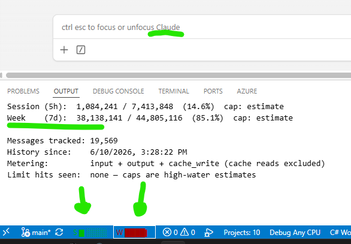

# Claude Usage Bar

Two bars in the VS Code status bar: **S** = rolling 5-hour session usage, **W** = rolling 7-day usage.

```
S █▋░░░   W ████▏
```

Reads Claude Code's own transcripts (`~/.claude/projects/**/*.jsonl`), which record exact token
counts per assistant message. No API calls, no scraping, no credentials.





## The cap is an estimate, and it is honest about that

Anthropic does not publish your session/weekly token caps, and they are not stored anywhere on disk.
So the bar cannot show "% of your limit" directly. Instead:

**The cap is a high-water mark.** It starts as the largest window you have ever *actually sustained*
across your whole transcript history, and it ratchets upward whenever you exceed it. Because you
sustained that window **without being cut off**, your true cap is at least that large — which means
the bar reads **high rather than low**. It warns early, never late. That is the safe direction for a
tool whose job is to stop you being surprised.

**It self-corrects the moment the truth becomes observable.** Claude Code records a hit limit as a
synthetic assistant message. The first time you genuinely hit a *session* or *weekly* limit, the
extension snaps that window's total in as the exact cap and stops estimating. Model-scoped limits
("You've reached your Fable 5 limit") are deliberately ignored — that is a separate budget, and
pinning it would give you a wrong number.

Hover either bar to see whether its cap is an estimate or an observed fact.

## Metering

By default: `input + output + cache_creation`. Cache **reads** are excluded, because they are ~97% of
raw token volume and are heavily discounted wherever they are metered — counting them would make the
bar track conversation length more than actual work. Flip `claudeUsageBar.includeCacheReads` if you
disagree; in practice all plausible meters agree on the percentage within about ten points.

## Colours

From the original sketch: green below 50%, yellow to 66%, orange to 75%, red to 100%, dark blue at
cap. `S` and `W` are separate status bar items, so they colour independently.

## Settings

| Setting | Default | |
|---|---|---|
| `claudeUsageBar.includeCacheReads` | `false` | count cache reads toward usage |
| `claudeUsageBar.sessionWindowHours` | `5` | session window length |
| `claudeUsageBar.weekWindowDays` | `7` | weekly window length |
| `claudeUsageBar.refreshSeconds` | `15` | poll interval |
| `claudeUsageBar.barCells` | `5` | bar width in characters (8 sub-steps each) |
| `claudeUsageBar.claudeHome` | `~/.claude` | override the Claude Code data directory |

Commands: **Claude Usage: Refresh now**, **Show details**, **Reset high-water marks**.

## Develop

```bash
npm install
npm run compile
# then press F5 in VS Code to launch an Extension Development Host
```

## Install locally

```bash
npx @vscode/vsce package
code --install-extension claude-usage-bar-0.1.0.vsix
```

## Performance

Cold scan of ~19,500 messages across ~200 transcripts: **~700ms**, once, at startup. After that each
poll reads only the bytes appended since the last one: **~8ms**.
